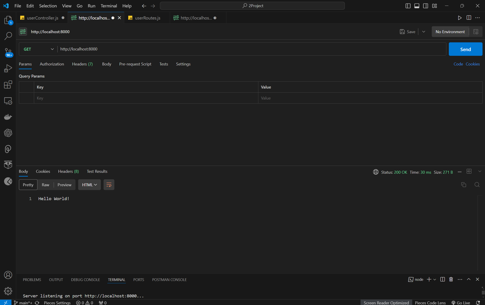
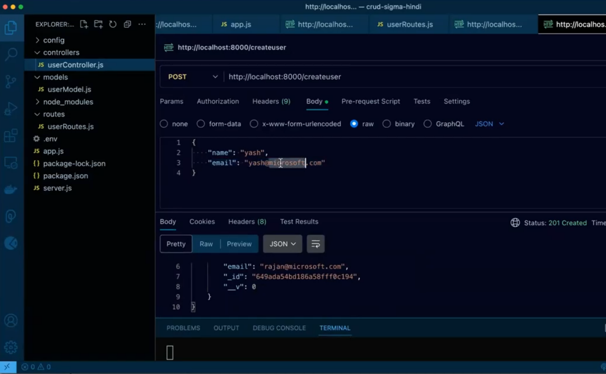
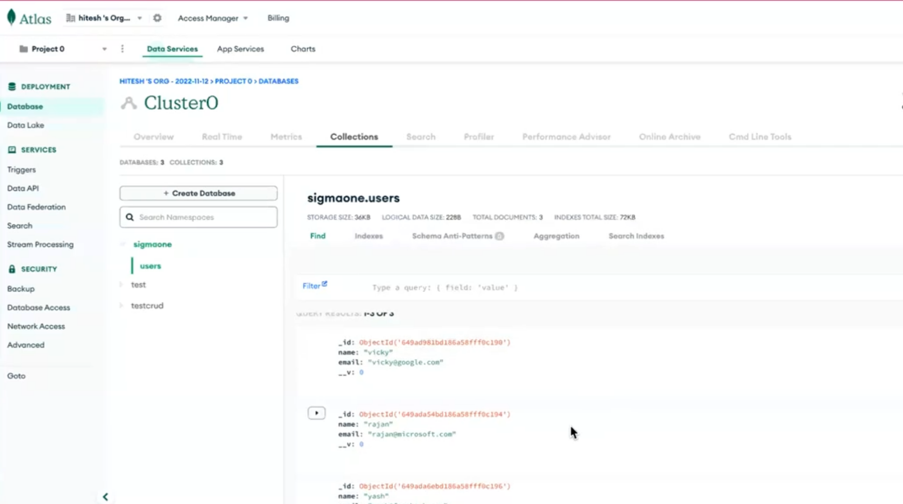
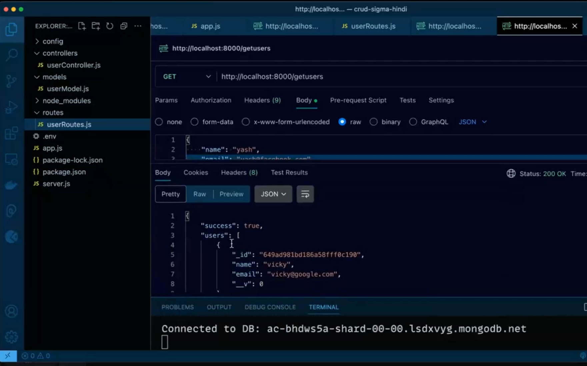
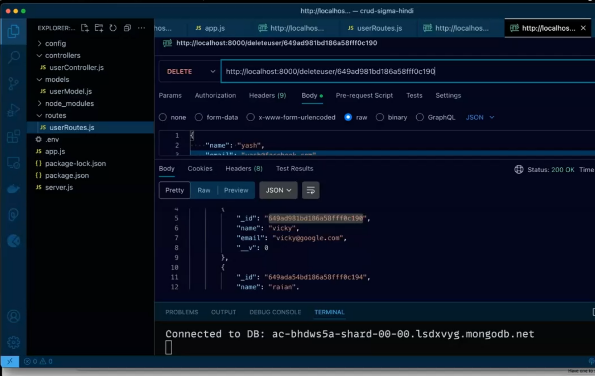

# CRUD User Management API

This project is a backend API for managing user details using Express.js and Mongoose. It provides endpoints to create, read, update, and delete user information. The application is connected to MongoDB via Mongoose.

## Features

- **Create User**: Add a new user to the database.
- **Read User**: Retrieve user details by ID or list all users.
- **Update User**: Modify existing user details.
- **Delete User**: Remove a user from the database.

## Technologies Used

- **Node.js**: JavaScript runtime for server-side development.
- **Express.js**: Web framework for Node.js to build APIs.
- **Mongoose**: ODM (Object Data Modeling) library for MongoDB and Node.js.
- **MongoDB**: NoSQL database for storing user data.


## Prerequisites
Ensure you have the following installed on your machine:
- **Node.js** (v14 or higher)
- **npm** (v6 or higher) or **Yarn** (v1.22 or higher)

## Installation
1. **Clone the Repository:**
    ```bash
    git clone https://github.com/yourusername/Crud-Backend-App.git
    cd pokedex
    ```

2. **Install Dependencies:**
    Using npm:
    ```bash
    npm install -y
    npm i express mongoose dotenv cors
    ```
   

## Running the Application
To start the development server:
```bash
npm start
```

## Home Page

## Create User

## Database

## Get User

## Delete User

## for running this project you have to make changes in .env file


